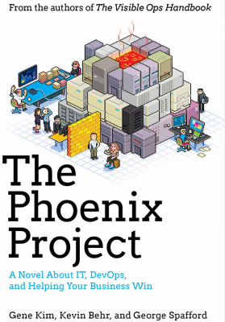

## The Speaker | Brooks Garrett
* Security Architect, Fortify on Demand
* CISSP, CSSLP
* Husband, Father, and Rugby Player?
* Volunteer Firefighter

---

## Roadmap

* Inspiration for the talk (Project Phoenix)
* 9/11
* Incident response
* Resource utilization
* Conclusion

---

## Phoenix Project

<!--
## Disclaimer

* Some of the content in this discussion may be upsetting
* I do not now nor did I ever work for the FDNY. I was in High School on 9/11
* It is not my claim that IT is as dangerous as fighting massive fires, but we can learn important lessons from that occupation
-->
---
# 9/11

---

## 9/11 | Are you ready?

> Everyone has a plan 'till they get punched in the mouth.

* Mike Tyson

---

## 9/11 | A Failure in Imagination

> The most important failure was one of imagination. We do not believe leaders understood 
> the gravity of the threat. The terrorist danger from Bin Ladin and al Qaeda was not a major 
> topic for policy debate among the public, the media, or in the Congress. Indeed, it barely 
> came up during the 2000 presidential campaign.

---

## 9/11 | Imagine

* When something can't be compromised, _imagine it was_.
* Murphy is your co-pilot.
* Plan for multiple concurrent failures.
* Attackers have time and imagination that isn't constrained by rules.
    *  _Don't be constrained by rules._

---

## 9/11 | Define the problem away

> Government agencies also sometimes display a tendency to match capabilities to 
> mission by defining away the hardest part of their job. They are often passive, 
> accepting what are viewed as givens, including that efforts to identify and fix 
> glaring vulnerabilities to dangerous threats would be too costly, too controversial, 
> or too disruptive. 

* 11.3

---

## 9/11 | Facing the challenges

* We can't accept failure.
* Never settle for the status quo.
* Business goals define security posture

# Learning from FireFighters

---

## Where do firefighters spend money?

* Maintenance
* Incident reponse
* Equipment

---

## Where do firefighters spend time?

. . .

* Prevention
* Education
* Training

# Thank You
